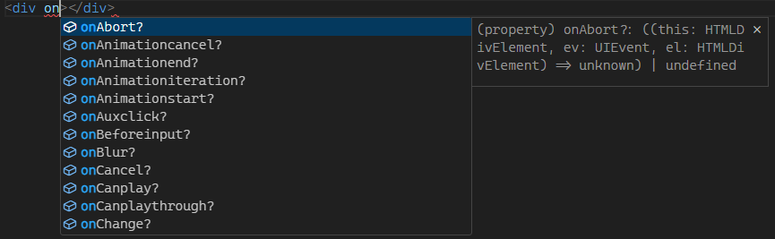

# Event Handlers
You may see some props starting with `on` while creating props:


Props starting with `on` are identified as "handler props", which acts just like normal element callbacks such as `onclick`.

Handler props are internally registered using `addEventListener`.

A event handler can receive two parameters. The first one is the event object just like using plain JavaScript, the second one is the target element itself.

```tsx
<button onClick={(ev, el) => {
    console.log(ev);
    el.textContent = 'Bruh who clicked me';
}}>Not yet clicked</button>
```

`this` is bound to the event element, just like plain JavaScript.
> Note: Arrow function doesn't work in this scenario, [see why on MDN](https://developer.mozilla.org/en-US/docs/Web/JavaScript/Reference/Functions/Arrow_functions#cannot_be_used_as_methods); You are forced to use normal `function` expression in this case

```tsx
<button onClick={function () {
    this.textContent = 'Bruh who clicked me';
}}>Not yet clicked</button>
```

# Element Refs

Element ref is a way to keep track of your element **after the element is created**. Using ref before the target element is created will cause an error.

Remember in the basics chapter, we [talked about the `VElement` type](./basics.md#basics), and said about that its second generic parameter is the ref type. Actually, a `VElement` is internally a [Proxy](https://developer.mozilla.org/en-US/docs/Web/JavaScript/Reference/Global_Objects/Proxy) object, which mappes the properties of a `VElement` to its target element's properties.

In short, `VElement`s can be treated as a normal element object after its target element's creation.
> Note: If using TypeScript, type assertion are required to make the ref type work normally.

<!-- TODO: improve this example using fragments -->
```tsx
let harryRef = <div>Hi! I'm Harry!</div> as VElement<'div', HTMLDivElement, unknown>;

<div>
    <button onClick={() => {
        harryRef.textContent = 'Ow! Charlie bit me!';
    }}>Bite Harry</button>
    {harryRef}
</div>
```

# Related Files
- [testcases/event](../../testcases/event/) (test spec: [event](../../cypress/e2e/event.cy.ts))
